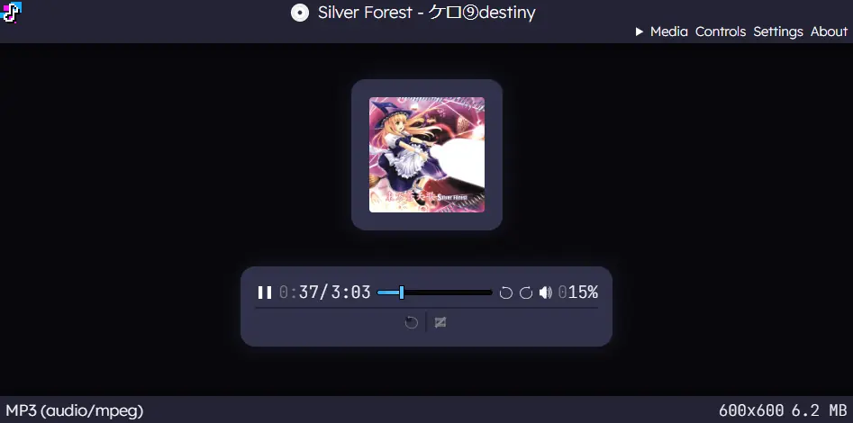
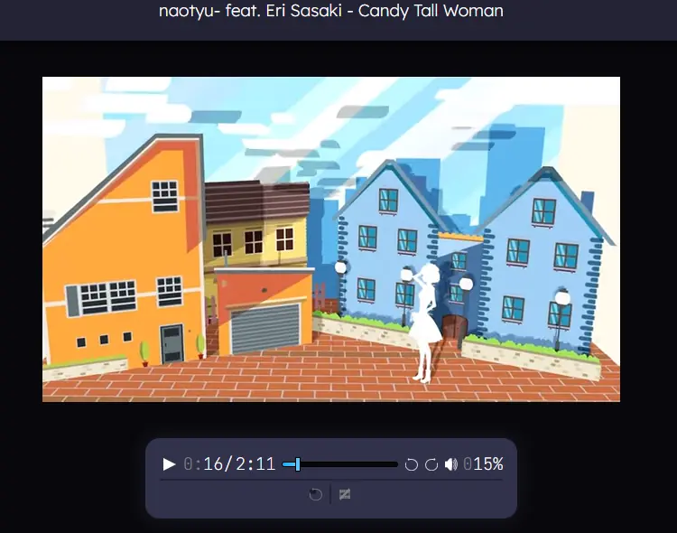
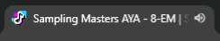

#   Tab that plays media  
A media player that fits in a browser tab.

*NOTE: this app is still in pre-release and might be a little buggy.*

 

# Features
- Play audio / video in a browser tab
- Displays album artwork included with audio file and displays other ID3 metadata
- Re-opens media if tab is accidentally closed then re-opened with Ctrl+Shift+T
- Website title will scroll if song title is too long (can be disabled)
- Progress is displayed with 1 decimal place if it's under a minute long

## How?
All the audio / video playing is handled by the browser's native <audio> and <video> tags. All I had to do was design an UI and hook most of the events to the new player.

## Why?
My laptop is a Chromebook (wouldn't recommend it to tech-savvy people) and I didn't like the built-in media player, so I just made my own. Since it's a chromebook, I know that no other media player will run (again, I don't recommend them).

# Running Locally
Yep, everything works when running locally. If you want to fully run offline, download the dependencies and change the paths in `index.html`.

## Dependencies
[jsmediatags](https://github.com/aadsm/jsmediatags) v3.9.7